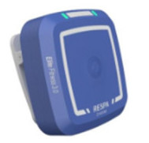
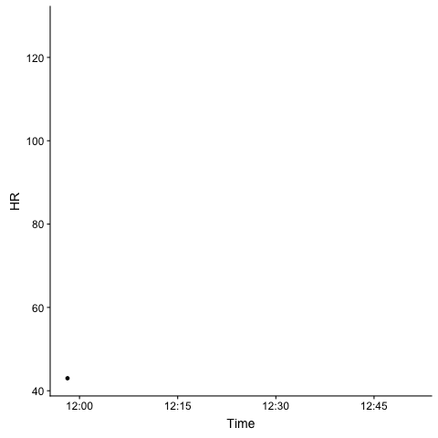

layout: true

<div class="my-footer">
<span>DC R Conference, 2018</span></div>
---


```{r setup, include=FALSE, cache=TRUE}
knitr::opts_chunk$set(echo=F, warning=F, message=F)
# devtools::install_github('webbedfeet/ProjTemplate')
# List of packages to be loaded are in lib/pkgs.yml
# Custom functions stored in lib/R
ProjTemplate::reload()
datadir = file.path(find_dropbox(), 'Baabi_GarfieldDeviceDataDownload','Mike Wardian')
load(file.path(datadir,'exdata.rda'))

gpx1 <- gpx %>% 
  mutate(Minutes = as.numeric(difftime(Time, min(Time), units = 'mins'))) %>% 
  filter(Minutes <= 50) %>% 
  left_join(run_data)

```

## About me

.pull-left[

+ Did genomics for 10 years
+ Consultant at NIH/NIAMS on rheumatology outcomes research
+ Co-founded Zansors, a healthcare technology and analytics startup
+ Reviewer/DSMB member for SBIR/trials in neurobiology/mental health
+ Teach _Practical R_ at NIH FAES Graduate School
+ Interests in statistical machine learning, data visualization, teaching
]

--

.pull-right[
+ One of the original members and co-organizer of Statistical Programming DC
+ Former Board Member of Data Community DC
+ Managed to co-author a book!!
</img>
]

---

## About me

</img>

---

.pull-left[

### Kokikai Aikido

+ My 2nd longest relationship (25+ years)
+ The reason I maintain some sanity
+ 4th degree black belt
+ Come visit my class in New Market, MD

]

--

.pull-right[
<video width="700" height="500" autoplay loop>
<source src="http://www.aikidorochester.com/videos/bgvid.mp4" type="video/mp4"></video>

PS: My teacher, standing in the back, is 80 years old and still **kicks butt**
]

---
class: inverse, middle, center

# Trip down memory lane


---
class:inverse,,middle

.pull-left[
</img>
]
.pull-right[
+ Personal health technology and analytics
+ Sleep apnea screening
+ Leveraging technology into activity monitoring for athletes and yogis

.right[</img>]

]

---

## Activity data

+ GPS data from Garmin Forerunner
    - with heart rate chest strap
--

+ GPX format
    - GPS Exchange format
    - There are packages to read this
        - `plotKML::readGPX`
        - `maptools::readGPS`
    - Turns out this is just an XML file
    - I went baremetal
    
---

## Activity data

```{r, echo=T, eval=F}
read_gpx <- function(fname){
  require(XML)
  require(tibble)
  require(lubridate)
  pfile <- htmlTreeParse(fname,
                         error = function (...) {}, useInternalNodes = T)
  # Get all elevations, times and coordinates via the respective xpath
  elevations <- as.numeric(xpathSApply(pfile, path = "//trkpt/ele", xmlValue))
  times <- as_datetime(as.character(xpathSApply(pfile, path = "//trkpt/time", xmlValue)))
  coords <- xpathSApply(pfile, path = "//trkpt", xmlAttrs)
  # Extract latitude and longitude from the coordinates
  lats <- as.numeric(coords["lat",])
  lons <- as.numeric(coords["lon",])
  # Put everything in a dataframe and get rid of old variables
  geodf <- data.frame(Latitude = lats, Longitude = lons, Elevation = elevations, Time = times)
  hrs <- as.numeric(xpathSApply(pfile, path = '//trkpt/extensions/trackpointextension/hr', xmlValue))
  if(length(hrs) > 0){
    geodf$HR = hrs
  }
  geodf <- as.tibble(geodf)
  return(geodf)
}

```


---

## Activity data

```{r, echo=T, eval=F}
read_gpx <- function(fname){
  require(XML)
  require(tibble)
  require(lubridate)
  pfile <- htmlTreeParse(fname,
                         error = function (...) {}, useInternalNodes = T)
  # Get all elevations, times and coordinates via the respective xpath
  elevations <- as.numeric(xpathSApply(pfile, path = "//trkpt/ele", xmlValue)) #<<
  times <- as_datetime(as.character(xpathSApply(pfile, path = "//trkpt/time", xmlValue))) #<<
  coords <- xpathSApply(pfile, path = "//trkpt", xmlAttrs) #<<
  # Extract latitude and longitude from the coordinates
  lats <- as.numeric(coords["lat",])
  lons <- as.numeric(coords["lon",])
  # Put everything in a dataframe and get rid of old variables
  geodf <- data.frame(Latitude = lats, Longitude = lons, Elevation = elevations, Time = times)
  hrs <- as.numeric(xpathSApply(pfile, path = '//trkpt/extensions/trackpointextension/hr', xmlValue)) #<<
  if(length(hrs) > 0){
    geodf$HR = hrs
  }
  geodf <- as.tibble(geodf)
  return(geodf)
}

```


---

## Respa by Zansors

</img>

+ Detecting breathing and motion
+ We'll distill the raw signals into 
    - Respiration rate (breaths per minute)
    - Cadence (steps per minute)

---

## An example run

```{r, out.width="100%", include=T}
leaflet(data = gpx1) %>% addTiles() %>% 
  addCircleMarkers(~ Longitude, ~ Latitude, radius = 1, color = 'blue')
```


---

class: inverse,center,middle

# ggplot +

---


## ggmap

.pull-left[
```{r, eval=F, echo=T}
library(ggmap)
register_google(key = readLines(file.path(find_dropbox(),'mapapi.txt'))[1])
p <- ggmap(get_map(c(mean(gpx1$Longitude),mean(gpx1$Latitude)), zoom=13,
                   maptype='roadmap'))

p + geom_point(aes(Longitude, Latitude), data = gpx1, color='blue') + 
  theme(axis.title = element_blank())
```
]
.pull-right[
```{r, eval=T, message=F}
library(ggmap)
register_google(key = readLines(file.path(find_dropbox(),'mapapi.txt'))[1])
p <- ggmap(get_map(c(mean(gpx1$Longitude),mean(gpx1$Latitude)), zoom=13,
                   maptype='roadmap'))

p + geom_point(aes(Longitude, Latitude), data = gpx1, color='blue') + 
  theme(axis.title = element_blank())
```
]

---


## ggmap

.pull-left[
```{r, eval=F, echo=T}
library(ggmap)
register_google(key = readLines(file.path(find_dropbox(),'mapapi.txt'))[1]) #<<
p <- ggmap(get_map(c(mean(gpx1$Longitude),mean(gpx1$Latitude)), zoom=13,
                   maptype='roadmap'))

p + geom_point(aes(Longitude, Latitude), data = gpx1, color='blue') + 
  theme(axis.title = element_blank())
```
]
.pull-right[
```{r, eval=T, message=F}
library(ggmap)
register_google(key = readLines(file.path(find_dropbox(),'mapapi.txt'))[1])
p <- ggmap(get_map(c(mean(gpx1$Longitude),mean(gpx1$Latitude)), zoom=13,
                   maptype='roadmap'))

p <- p + geom_point(aes(Longitude, Latitude), data = gpx1, color='blue') + 
  theme(axis.title = element_blank())
p
```
]

---


## cowplot

.pull-left[
```{r, message = F, warning = F, out.height="80%"} 
library(cowplot)
p1 <- ggplot(gpx1, aes(Minutes, Elevation)) + geom_line()
p2 <- ggplot(gpx1, aes(Minutes, HR))+geom_line()
p3 <- ggplot(gpx1, aes(Minutes, Respiration))+geom_line()

p
```
]
.pull-right[
```{r}
p2
```

]

---


## Linking location and heart rate

```{r, include=T, eval=F, echo=T}
shared_gpx1 <- SharedData$new(gpx1)
bscols(
  leaflet(data = shared_gpx1, width="100%", height=450) %>% addTiles() %>% 
    addCircleMarkers(~Longitude, ~Latitude, radius=1, color='blue'),
  list(
  d3scatter(shared_gpx1, ~Minutes, ~ HR, width="100%", height=450)
  )
)
bscols(
  filter_slider("Minutes","Time", shared_gpx1, ~Minutes, width="100%")
)
```

.center[`leaflet` + `d3scatter` + `crosstalk`]

---


## Linking location and heart rate

```{r, include=T, eval=F, echo=T}
shared_gpx1 <- SharedData$new(gpx1)
bscols(
  leaflet(data = shared_gpx1, width="100%", height=450) %>% addTiles() %>% 
    addCircleMarkers(~Longitude, ~Latitude, radius=1, color='blue'),
  list(
  d3scatter(shared_gpx1, ~Minutes, ~ HR, width="100%", height=450)
  )
)
{{bscols(
  filter_slider("Minutes","Time", shared_gpx1, ~Minutes, width="100%")
)}}
```

.center[`leaflet` + `d3scatter` + `crosstalk`]

---


## Linking location and heart rate 

```{r, include=T}
shared_gpx1 <- SharedData$new(gpx1)
bscols(
  leaflet(data = shared_gpx1, width="100%", height=450) %>% addTiles() %>% 
    addCircleMarkers(~Longitude, ~Latitude, radius=1, color='blue'),
  list(
  d3scatter(shared_gpx1, ~Minutes, ~ HR, width="100%", height=450)
  )
)
bscols(
  filter_slider("Minutes","Time", shared_gpx1, ~Minutes, width="100%")
)
```


---


## Linking location and heart rate and respiration

```{r, echo=T, eval=F}
shared_gpx1 <- SharedData$new(gpx1)
bscols(
  leaflet(data = shared_gpx1, width="100%", height=450) %>% addTiles() %>% 
    addCircleMarkers(~Longitude, ~Latitude, radius=1, color='blue'),
  list(
  d3scatter(shared_gpx1, ~Minutes, ~ HR, width="100%", height=225),
  d3scatter(shared_gpx1, ~Minutes, ~ Respiration, width="100%", height=225) #<<
  )
)
bscols(
  filter_slider("Minutes","Time", shared_gpx1, ~Minutes, width="100%")
)
```


---


## Linking location and heart rate and respiration

```{r, echo=F, eval=T}
shared_gpx1 <- SharedData$new(gpx1)
bscols(
  leaflet(data = shared_gpx1, width="100%", height=450) %>% addTiles() %>% 
    addCircleMarkers(~Longitude, ~Latitude, radius=1, color='blue'),
  list(
  d3scatter(shared_gpx1, ~Minutes, ~ HR, width="100%", height=225),
  d3scatter(shared_gpx1, ~Minutes, ~ Respiration, width="100%", height=225) #<<
  )
)
bscols(
  filter_slider("Minutes","Time", shared_gpx1, ~Minutes, width="100%")
)
```


---


# Next steps

### Create a dashboard using `flexdashboard`

### Create a Shiny app

### Have some fun ....

---
class: inverse, center, middle

# gganimate 

---


```{r, echo=T, eval=F}
library(gganimate)
p + transition_reveal(gpx1$Minutes, gpx1$Minutes)
p2 + transition_reveal(gpx1$Minutes, gpx1$Minutes)
```
.pull-left[
</img>
]
.pull-right[
</img>
]

---
class: middle, center

# Thank you

[http://webbedfeet.netlify.com](http://webbedfeet.netlify.com)


