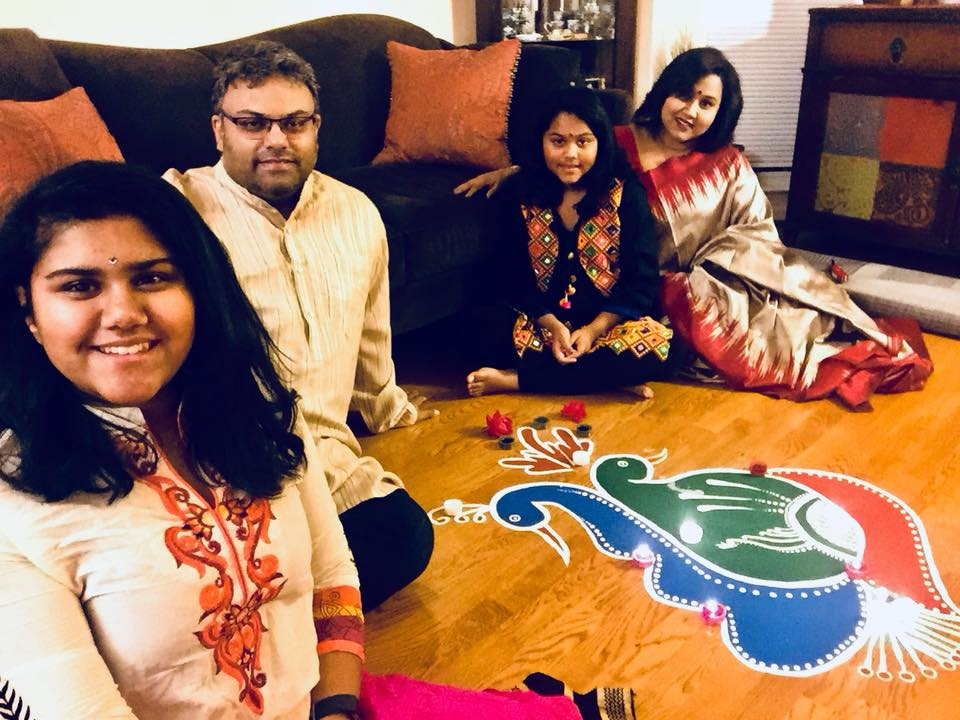

layout: true

<div class="my-footer">
<span>DC R Conference, 2018</span></div>
---

```{r setup, include=FALSE, cache=TRUE}
knitr::opts_chunk$set(echo=F)
# devtools::install_github('webbedfeet/ProjTemplate')
# List of packages to be loaded are in lib/pkgs.yml
# Custom functions stored in lib/R
ProjTemplate::reload()
datadir = file.path(find_dropbox(), 'Baabi_GarfieldDeviceDataDownload','Mike Wardian')
load(file.path(datadir,'exdata.rda'))

gpx1 <- gpx %>% 
  mutate(Minutes = as.numeric(difftime(Time, min(Time), units = 'mins'))) %>% 
  filter(Minutes <= 50) %>% 
  left_join(run_data)

```

## About me

.pull-left[

+ Did genomics for 10 years
+ Consultant at NIH/NIAMS on rheumatology outcomes research
+ Co-founded Zansors, a healthcare technology and analytics startup
+ Reviewer/DSMB member for SBIR/trials in neurobiology/mental health
+ Teach _Practical R_ at NIH FAES Graduate School
+ Interests in statistical machine learning, data visualization, teaching
]

--

.pull-right[
+ One of the original members and co-organizer of Statistical Programming DC
+ Former Board Member of Data Community DC
+ Managed to co-author a book!!
</img>
]

---

## About me

</img>

---

.pull-left[

### Kokikai Aikido

+ My 2nd longest relationship (25+ years)
+ The reason I maintain some sanity
+ 4th degree black belt
+ Come visit my class in New Market, MD

]

--

.pull-right[
<video width="700" height="500" autoplay loop>
<source src="http://www.aikidorochester.com/videos/bgvid.mp4" type="video/mp4"></video>

PS: My teacher, standing in the back, is 80 years old and still **kicks butt**
]

---
class:inverse,,middle

.pull-left[
</img>
]
.pull-right[
+ Personal health technology and analytics
+ Sleep apnea screening
+ Leveraging technology into activity monitoring for athletes and yogis

.right[</img>]

]

---
## An example run

```{r, out.width="100%", include=F}
leaflet(data = gpx1) %>% addTiles() %>% 
  addCircleMarkers(~ Longitude, ~ Latitude, radius = 1, color = 'blue')
```

---

## Linking location and heart rate

```{r, include=F}
shared_gpx1 <- SharedData$new(gpx1)
bscols(
  leaflet(data = shared_gpx1, width="100%", height=450) %>% addTiles() %>% 
    addCircleMarkers(~Longitude, ~Latitude, radius=1, color='blue'),
  d3scatter(shared_gpx1, ~Minutes, ~ HR, width="100%", height=450)
)
bscols(
  filter_slider("Minutes","Time", shared_gpx1, ~Minutes, width="100%")
)
```

---

## Linking location and heart rate and respiration

```{r, include=F}
shared_gpx1 <- SharedData$new(gpx1)
bscols(
  leaflet(data = shared_gpx1, width="100%", height=450) %>% addTiles() %>% 
    addCircleMarkers(~Longitude, ~Latitude, radius=1, color='blue'),
  list(
  d3scatter(shared_gpx1, ~Minutes, ~ HR, width="100%", height=225),
  d3scatter(shared_gpx1, ~Minutes, ~ Respiration, width="100%",height=225 )
  )
)
bscols(
  filter_slider("Minutes","Time", shared_gpx1, ~Minutes, width="100%")
)
```

---

## Linking location, heart rate, respiration, elevation

```{r, include=F}
shared_gpx1 <- SharedData$new(gpx1)
bscols(
  leaflet(data = shared_gpx1, width="100%", height=450) %>% addTiles() %>% 
    addCircleMarkers(~Longitude, ~Latitude, radius=1, color='blue'),
  list(
  d3scatter(shared_gpx1, ~Minutes, ~ HR, width="100%", height=150),
  d3scatter(shared_gpx1, ~Minutes, ~ Respiration, width="100%",height=150 ),
  d3scatter(shared_gpx1, ~Minutes, ~ Elevation, width="100%",height=150 )
  )
)
bscols(
  filter_slider("Minutes","Time", shared_gpx1, ~Minutes, width="100%")
)
```
